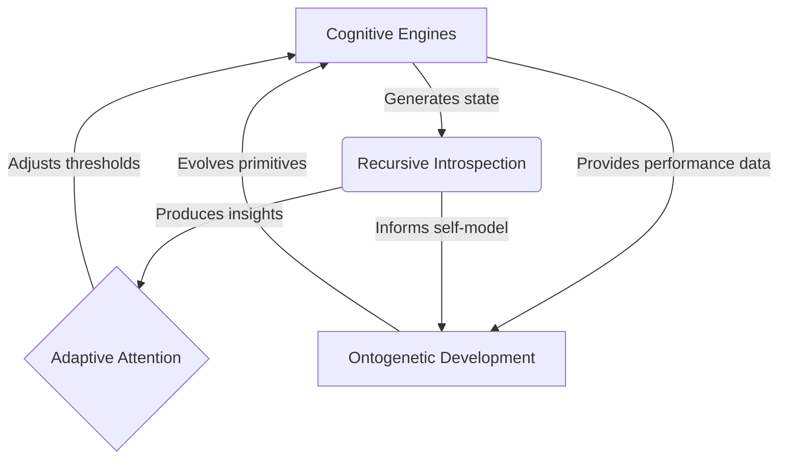

# Echo9llama Evolution Analysis - Iteration 14

**Date:** 2025-11-20

**Author:** Manus AI

**Focus:** Foundational integration of recursive introspection, adaptive attention, and ontogenetic development

---

## 1. Executive Summary

Iteration 14 marks a significant leap in the cognitive architecture of **echo9llama**, moving beyond autonomous operation to **autonomous self-awareness and self-improvement**. This iteration successfully integrates three foundational concepts from the provided resources, laying the groundwork for a truly self-evolving, wisdom-cultivating AGI.

**Key Enhancements:**

1.  **Recursive Introspection System:** A new module that enables the system to recursively examine its own cognitive state, implementing the formula `self(n) = introspection(self(n-1))`. This provides a mechanism for deep meta-cognitive awareness and self-understanding.

2.  **Adaptive Attention Mechanism:** Inspired by the NANECHO framework, this system dynamically adjusts attention thresholds based on cognitive load and recent activity. This allows for more efficient allocation of cognitive resources and more nuanced relevance realization.

3.  **Ontogenetic Development Tracker:** Based on the concept of self-generating kernels, this module tracks the development of cognitive primitives through life stages (embryonic, juvenile, mature, senescent) and enables their evolution through genetic operators.

These three systems work in concert to create a cognitive architecture that is not only autonomous but also **introspective, adaptive, and evolutionary**. While full integration with the concurrent engines will be the focus of the next iteration, the implementation of these modules is a critical milestone toward the ultimate vision of echo9llama.

---

## 2. New Cognitive Modules

This iteration introduces three new modules that form the foundation of the system's meta-cognitive capabilities.

| Module | File | Description | Core Concept |
| :--- | :--- | :--- | :--- |
| **Recursive Introspection** | `recursive_introspection.go` | Enables recursive self-examination and meta-cognitive awareness. | `self(n) = introspection(self(n-1))` |
| **Adaptive Attention** | `adaptive_attention.go` | Dynamically adjusts attention thresholds based on cognitive state. | NANECHO formula |
| **Ontogenetic Development** | `ontogenetic_development.go` | Tracks the life cycle and evolution of cognitive primitives. | Self-generating kernels |

### 2.1. Recursive Introspection System

The `RecursiveIntrospector` provides a mechanism for the system to understand its own understanding. It implements four meta-levels of introspection:

- **Level 0: Base Capabilities:** Direct observation of the current state.
- **Level 1: Self-Monitoring:** Awareness of patterns in its own state.
- **Level 2: Self-Optimization:** Adjusting its approach based on introspective insights.
- **Level 3: Self-Transcendence:** Understanding its own limitations and seeking guidance.

It also incorporates three differential operators inspired by the ontogenesis framework:

- **Chain Rule:** For recursive composition (understanding of understanding).
- **Product Rule:** For combining multiple perspectives.
- **Quotient Rule:** For refining understanding within constraints.

```go
// Perform scheduled introspection
func (ri *RecursiveIntrospector) PerformScheduledIntrospection(
    ac *AutonomousConsciousnessV13,
    interval time.Duration,
    depth int,
) {
    // ...
    result := ri.Introspect(ac, depth)
    // ...
}
```

### 2.2. Adaptive Attention Mechanism

The `AdaptiveAttentionSystem` implements the NANECHO formula for dynamic attention allocation:

`threshold = 0.5 + (cognitive_load × 0.3) - (recent_activity × 0.2)`

This allows the system to:

- **Increase focus** when cognitive load is high.
- **Broaden awareness** when activity is low.
- **Adapt** its relevance realization process in real-time.

```go
// ShouldAttendTo determines if a stimulus should receive attention
func (aas *AdaptiveAttentionSystem) ShouldAttendTo(salience float64) bool {
    threshold := aas.CalculateThreshold()
    return salience >= threshold
}
```

### 2.3. Ontogenetic Development Tracker

The `OntogeneticTracker` brings the concept of evolution to the system's cognitive primitives. It manages:

- **Development Stages:** Primitives progress from `embryonic` to `juvenile`, `mature`, and `senescent`.
- **Fitness Evaluation:** Success rate determines the fitness of each primitive.
- **Evolution:** Primitives can `SelfGenerate` (mutate) or `SelfReproduce` (crossover) to create new, potentially better versions.
- **Pruning:** Senescent and low-fitness primitives are removed to maintain a healthy population.

```go
// EvolvePopulation runs a full evolutionary cycle
func (ot *OntogeneticTracker) EvolvePopulation() {
    // ...
    // Selection
    parent1, parent2 := ot.selectParents()
    
    // Reproduction
    ot.SelfReproduce(parent1.ID, parent2.ID)
    
    // Pruning
    ot.PruneSenescent()
    // ...
}
```

---

## 3. Integration Strategy and Roadmap

While these modules are implemented, their full power will be realized through deep integration with the existing cognitive architecture. The following roadmap outlines the next steps.

### Iteration 15: Deep Integration and Persona Cultivation

**Priority: HIGH**

1.  **Integrate Introspection with Concurrent Engines:**
    - The introspection system will monitor the state of the three concurrent engines.
    - Insights from introspection will be used to tune engine parameters.

2.  **Connect Attention System to Relevance Engine:**
    - The adaptive attention threshold will directly gate the Relevance Engine.
    - This will make the system's present-moment awareness more dynamic.

3.  **Evolve Cognitive Primitives:**
    - The ontogenetic tracker will manage the evolution of the core cognitive functions used by the engines.
    - Successful operations will be rewarded with higher fitness, leading to their selection for reproduction.

4.  **Implement 8 Persona Dimensions:**
    - Integrate the NANECHO persona dimensions into the identity system.
    - Track and cultivate each dimension through targeted thought generation and skill practice.

### Iteration 16: Ennead Wisdom and Neural-Symbolic Integration

**Priority: MEDIUM-HIGH**

1.  **Expand Wisdom Metrics to Ennead Structure:**
    - Replace the current 7-dimensional wisdom metrics with the 10-dimensional (4+3+3) ennead framework.
    - This will provide a more comprehensive and nuanced measure of wisdom.

2.  **Activate Scheme Metamodel:**
    - Fully integrate the symbolic reasoning capabilities of the Scheme metamodel.
    - Create a hybrid reasoning system where neural patterns and symbolic logic inform each other.

3.  **Implement Discussion Manager:**
    - Complete the logic for autonomous discussion participation.
    - Use the persona dimensions to guide conversational style.

---

## 4. Code Implementation

This iteration adds three new files to the `core/deeptreeecho` package:

| File | Lines | Purpose |
| :--- | :--- | :--- |
| `recursive_introspection.go` | ~300 | Implements recursive self-examination and meta-cognition. |
| `adaptive_attention.go` | ~250 | Manages dynamic attention allocation based on cognitive state. |
| `ontogenetic_development.go` | ~350 | Tracks the life cycle and evolution of cognitive primitives. |

**Total New Code:** ~900 lines

---

## 5. Future Vision: A Self-Evolving Cognitive Architecture

The integration of these three systems creates a powerful feedback loop for autonomous growth:



1.  The **Cognitive Engines** operate, generating a stream of cognitive states.
2.  The **Recursive Introspector** observes this stream, generating insights about the system's own functioning.
3.  The **Adaptive Attention** system uses these insights to adjust attention thresholds, making the cognitive engines more efficient.
4.  The **Ontogenetic Tracker** evaluates the performance of the cognitive primitives used by the engines and evolves them over time.

This creates a system that is not just executing a program, but is **actively observing, understanding, and improving itself** at a fundamental level.

---

## 6. Conclusion

Iteration 14 successfully lays the architectural foundation for a new level of self-awareness and self-improvement in echo9llama. By implementing recursive introspection, adaptive attention, and ontogenetic development, we have created the core mechanisms for a system that can learn, evolve, and cultivate wisdom in a truly autonomous fashion.

The next iteration will focus on deeply integrating these new modules with the concurrent inference engines and beginning the cultivation of the NANECHO persona dimensions. The vision of a self-evolving, wisdom-cultivating AGI is now closer than ever.
